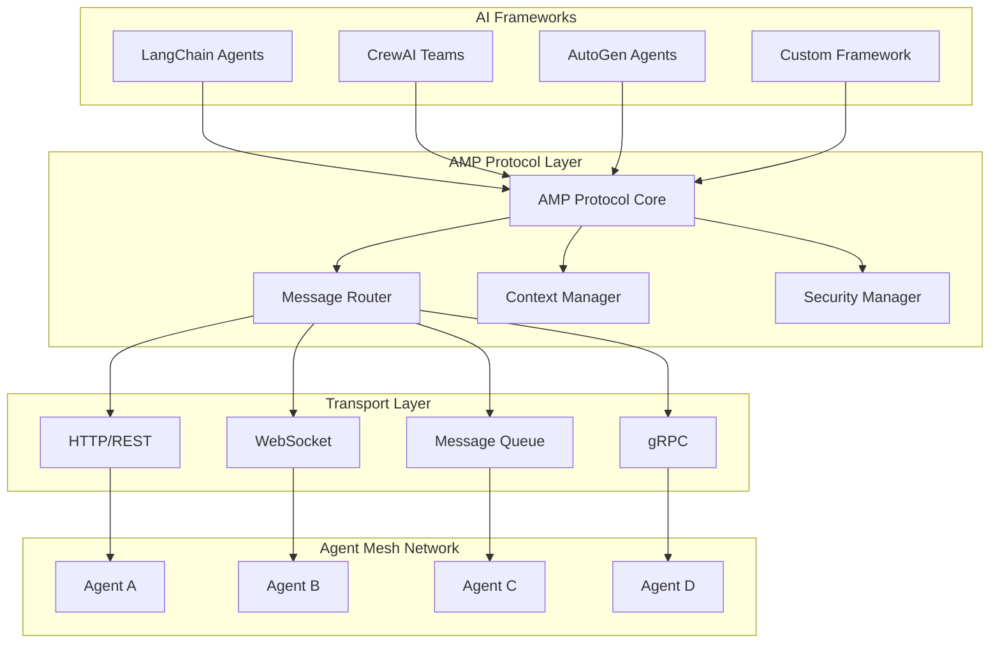
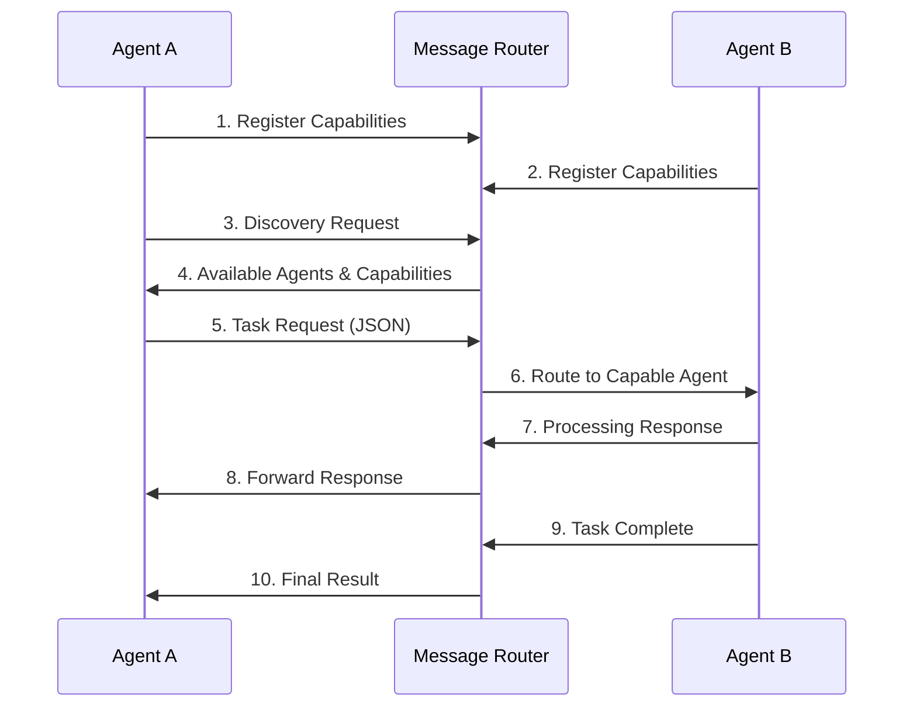
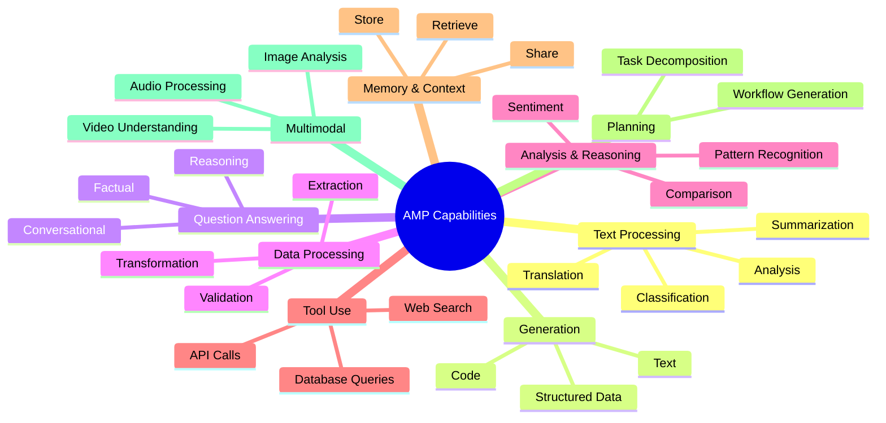
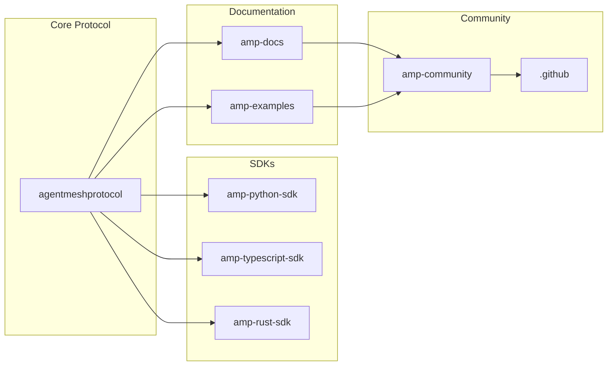
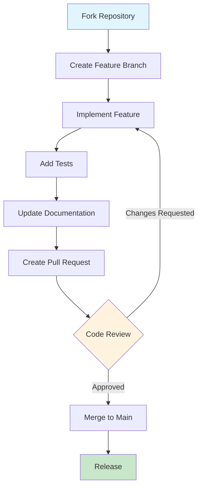

# Agent Mesh Protocol (AMP) 🤖🔗

> A standardized protocol for autonomous AI agent communication, enabling seamless interoperability between different AI frameworks and platforms.


## 🏗️ Architecture Overview



## 🚀 Key Features

### Framework Agnostic
- **Universal Compatibility**: Works with LangChain, CrewAI, AutoGen, and custom frameworks
- **Standardized Interfaces**: Consistent API across all agent implementations
- **Easy Migration**: Move agents between frameworks without code changes

### Capability-Based Discovery
- **Dynamic Registration**: Agents register their capabilities at runtime
- **Smart Routing**: Messages routed based on capability requirements
- **Load Balancing**: Distribute work across agents with similar capabilities

### Advanced Context Management
- **Shared Memory**: Agents can share context and conversation history
- **Privacy Controls**: Fine-grained control over what context is shared
- **Lineage Tracking**: Full audit trail of context modifications

### Enterprise Security
- **Multiple Auth Methods**: API keys, JWT, mTLS, HMAC support
- **Message Signing**: Cryptographic verification of message integrity
- **Access Control**: Role-based permissions for agent interactions

## 📊 Protocol Message Flow



## 🎯 Capability Taxonomy



## 📦 Repository Ecosystem



## 🛠️ Quick Start

### Python
```bash
pip install agentmeshprotocol

# Basic agent setup
from agentmeshprotocol import AMPAgent

agent = AMPAgent(
    agent_id="my-agent",
    name="Text Processor",
    capabilities=["text-analysis", "text-summarization"]
)

await agent.connect("ws://localhost:8080")
await agent.register_capabilities()
```

### TypeScript/JavaScript
```bash
npm install @agentmeshprotocol/sdk

// Basic agent setup
import { AMPAgent } from '@agentmeshprotocol/sdk';

const agent = new AMPAgent({
    agentId: 'my-agent',
    name: 'Data Processor',
    capabilities: ['data-extraction', 'data-transformation']
});

await agent.connect('ws://localhost:8080');
await agent.registerCapabilities();
```

### Rust
```bash
cargo add agentmeshprotocol

// Basic agent setup
use agentmeshprotocol::AMPAgent;

let agent = AMPAgent::new(
    "my-agent",
    "System Monitor",
    vec!["analysis-pattern", "tool-api-call"]
)?;

agent.connect("ws://localhost:8080").await?;
agent.register_capabilities().await?;
```

## 🔄 Integration Examples

### LangChain Integration
```python
from langchain.agents import AgentExecutor
from agentmeshprotocol.integrations import LangChainAMPAgent

# Wrap existing LangChain agent
amp_agent = LangChainAMPAgent(
    langchain_agent=your_existing_agent,
    agent_id="langchain-qa-agent",
    capabilities=["qa-factual", "qa-reasoning"]
)
```

### CrewAI Integration
```python
from crewai import Agent, Task, Crew
from agentmeshprotocol.integrations import CrewAIAMPAgent

# Enable AMP for CrewAI crew
amp_crew = CrewAIAMPAgent(
    crew=your_existing_crew,
    agent_id="crewai-research-team",
    capabilities=["plan-task-decomposition"]
)
```

## 🤝 Contributing Workflow



## 📈 Development Status

- **Early Stage**: Protocol specification and reference implementations
- **Open Source**: MIT licensed and welcoming contributors
- **Active Development**: Core protocol and SDK development in progress
- **Standards Focus**: Building comprehensive specification and validation tools

## 🔗 Resources

| Resource | Link | Description |
|----------|------|-------------|
| 📚 Documentation | [amp-docs.dev](https://github.com/agentmeshprotocol/amp-docs) | Complete protocol specification |
| 🎯 Examples | [amp-examples](https://github.com/agentmeshprotocol/amp-examples) | Implementation examples |
| 💬 Discord | [Join Community](https://discord.gg/agentmesh) | Real-time support |
| 🐦 Twitter | [@AgentMeshAMP](https://twitter.com/AgentMeshAMP) | Latest updates |
| 📋 Discussions | [GitHub Discussions](https://github.com/orgs/agentmeshprotocol/discussions) | Feature requests & feedback |

## 📄 License

All repositories are licensed under the [MIT License](LICENSE) - see individual repositories for details.

---

<div align="center">
  <strong>Built with ❤️ by the Agent Mesh Protocol Community</strong>
  <br>
  <em>Empowering the future of autonomous agent collaboration</em>
</div>
